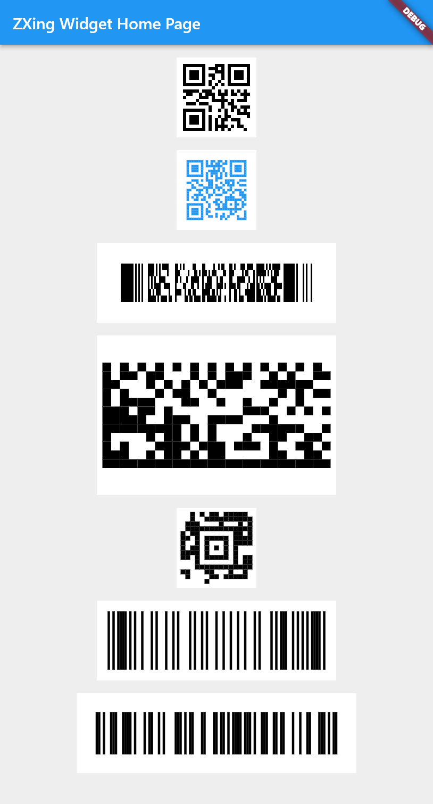

# ZXing Widget(Dart)
[](https://pub.dartlang.org/packages/zxing_widget)

A Barcode Generator Widget that can be embedded inside flutter. It uses zxing-dart for all platforms.

| | |
|:---:|:---:|
|ZXing Dart|[](https://pub.dartlang.org/packages/zxing_lib)|
|ZXing Widget|[](https://pub.dartlang.org/packages/zxing_widget)|
|ZXing Scanner|[](https://pub.dartlang.org/packages/zxing_scanner)|

## Features

- ✅ QRCode
- ✅ PDF417 code
- ✅ DataMatrix code
- ✅ AZTec code
- ✅ OneDemension code
- ✅ Paint callback
- ✅ Customize color

## Preview



## Getting started

flutter pub add zxing_widget

## Usage

See `/example` folder.

Scan from camera
```dart
BarcodeWidget(
    QrcodePainter(
        'qrcode data',
        errorCorrectionLevel: ErrorCorrectionLevel.H,
        foregroundColor: Colors.blue,
    ),
    size: const Size(200, 200),
),
```

## Additional information

This package depends on [zxing_lib](https://pub.dartlang.org/packages/zxing_lib) witch is a pure dart port of ZXing.
